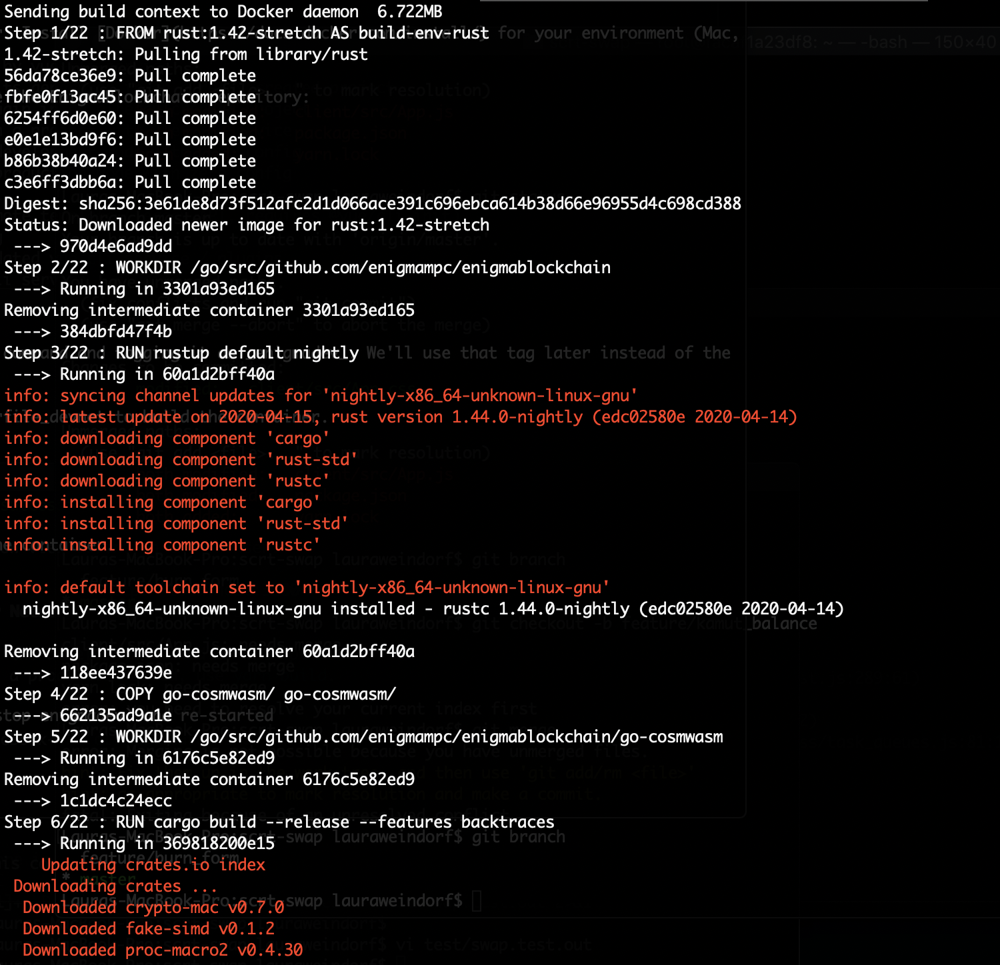
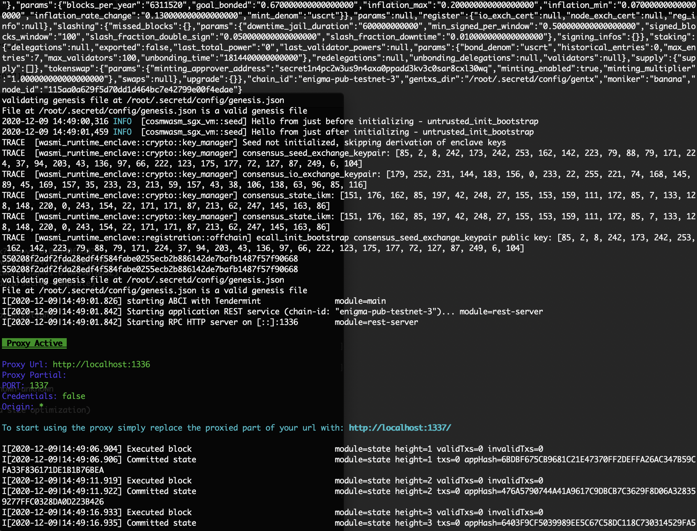
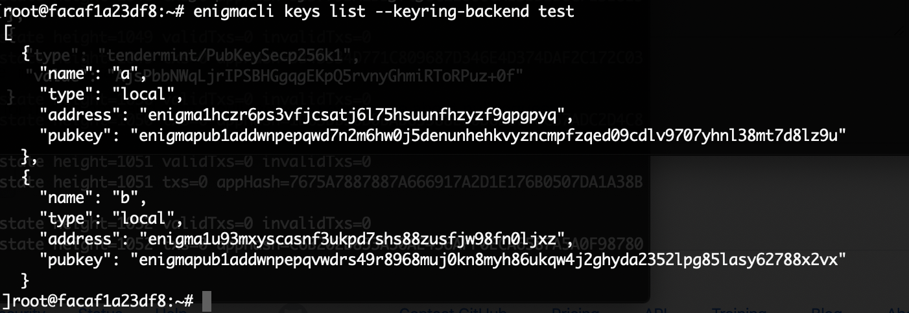

# enigma-dev-x

This repository can be used to get up and running on a local Enigma Blockchain developer testnet (enigmadev) to start working with the cosmwasm-based smart contracts (soon to be secret contracts!).

A few important notes:
- smart contracts in this repo are a precursor to Enigma's Secret Contracts, which enable data privacy
- smart contracts are written in Rust and based on cosmwasm, and the module is referred to as `compute` in the Enigma Blockchain. This will be also true of Secret Contracts!
- these cosmwasm-based smart contracts should be reusable and easily modified once we incorporate data privacy

## Setup the Local Developer Testnet

The developer blockchain is configured to run inside a docker container. Install [Docker](https://docs.docker.com/install/) for your environment (Mac, Windows, Linux).

Open a terminal window and change to your project directory. Then clone the EnigmaBlockchain repository:

```
$ git clone https://github.com/enigmampc/EnigmaBlockchain.git
```

Change directory:

```
$ cd EnigmaBlockchain
```

In the same terminal, create the docker image by issuing the build command and tagging it as _enigmadev_. We'll use that tag later instead of the container id, which can be a bit cryptic and hard to remember.

The command below tells Docker to follow the instructions in the Dockerfile_devnet to build the image.

```
docker build -f Dockerfile_devnet -t enigmadev .
```



To verify the _enigmadev_ docker image was created:

```
docker image ls enigmadev
```

Now that we've created the local EnigmaBlockchain docker image we can run it as a container:

```
docker run -d \
 -p 26657:26657 -p 26656:26656 -p 1317:1317 \
 --name enigmadev enigmadev
```




**NOTE**: The _engimadev_ docker container can be stopped by using (in a separate terminal) `docker stop enigmadev` and re-started 
using `docker start -i enigmadev`.


At this point you're running a local EnigmaBlockchain full-node.

In another terminal run a `bash` shell in the `enigmadev` container so we can view and manage the enigma keys:

```
docker exec -it enigmadev /bin/bash
```

The local blockchain has a couple of keys setup for you (similar to accounts if you're familiar with Truffle Ganache). The keys are stored in the `test` keyring backend, which makes it easier for local development and testing.

```
enigmacli keys list --keyring-backend test
````




At this point you've:

1. Created the local Enigma developer testnet

2. Started the EnigmaBlockchain

3. Listed the keys/accounts 


This process is similar to `discovery init` and `discovery start` and may be streamlined in the future.


## Setup Enigma Smart Contracts (cosmwasm)

These are the steps required to get setup to use _compute_ (Enigma Blockchain's initial implementation of cosmwasm smart contracts)

1. Install Rust, using the rustup installer
```
curl --proto '=https' --tlsv1.2 -sSf https://sh.rustup.rs | sh
```

2. Install cargo generate
```
cargo install cargo-generate --features vendored-openssl
```

3. Add rustup target wasm32 for both stable and nightly
```
rustup default stable
rustup target list --installed
rustup target add wasm32-unknown-unknown

rustup install nightly
rustup target add wasm32-unknown-unknown --toolchain nightly
```

## Create Initial Smart Contract

4. Generate the smart contract project
```
cargo generate --git https://github.com/confio/cosmwasm-template.git --name <your-project-name>
```
The generate creates a directory with the project name and has this structure:

```
Cargo.lock	Developing.md	LICENSE		Publishing.md	examples	schema		tests
Cargo.toml	Importing.md	NOTICE		README.md	rustfmt.toml	src
```

## Compile

5. Built smart contract —> wasm (compile)
```
cargo wasm
```

## Unit Tests

Run unit tests
```
RUST_BACKTRACE=1 cargo unit-test
```

## Integration Tests

The integration tests are under the `tests/` directory and run as:

```
cargo integration-test
```

## Generate Msg Schemas

We can also generate JSON Schemas that serve as a guide for anyone trying to use the contract, to specify which arguments they need.

Auto-generate msg schemas (when changed):

```
cargo schema
```


## Deploy Smart Contract

Before deploying or storing the contract on the testnet, need to run the cosmwasm optimizer.

### Optimize compiled wasm

```
docker run --rm -v $(pwd):/code \
  --mount type=volume,source=$(basename $(pwd))_cache,target=/code/target \
  --mount type=volume,source=registry_cache,target=/usr/local/cargo/registry \
  confio/cosmwasm-opt:0.7.3
```
The contract wasm needs to be optimized to get a smaller footprint. Cosmwasm notes state the contract would be too large for the blockchain unless optimized. This example contract.wasm is 1.8M before optimizing, 90K after.

The optimization creates two files:
- contract.wasm
- hash.txt

### Store the Smart Contract on our local Testnet

```
# First lets start it up again, this time mounting our project's code inside the container.
docker run -d -p 26657:26657 -p 26656:26656 -p 1317:1317 \
 -v $(pwd):/root/code \
 --name enigmadev enigmadev
 ```

Upload the optimized contract.wasm to the enigma-testnet:

```
cd code

enigmacli tx compute store contract.wasm --from a --gas auto -y --keyring-backend test
```

You can also store [verified code](https://www.cosmwasm.com/docs/tooling/verify)

Uploading verified code requires 2 additional params, source of the crate, and the builder that optimized the compiled wasm.

```
enigmacli tx compute store contract.wasm \
--builder="confio/cosmwasm-opt:0.7.3" \
--source="https://crates.io/api/v1/crates/<your-project-name>/0.0.1/download" \
--from a --gas auto -y
```

### Querying the Smart Contract and Code

12. List current smart contract code
```
enigmacli query compute list-code
[
  {
    "id": 1,
    "creator": "enigma1klqgym9m7pcvhvgsl8mf0elshyw0qhruy4aqxx",
    "data_hash": "0C667E20BA2891536AF97802E4698BD536D9C7AB36702379C43D360AD3E40A14",
    "source": "",
    "builder": ""
  }
]
```

### Instantiate the Smart Contract

At this point the contract's been uploaded and stored on the testnet, but there's no "instance." 
This is like `discovery migrate` which handles both the deploying and creation of the contract instance, except in Cosmos the deploy-execute process consists of 3 steps rather than 2 in Ethereum. You can read more about the logic behind this decision, and other comparisons to Solidity, in the [cosmwasm documentation](https://www.cosmwasm.com/docs/getting-started/smart-contracts). These steps are:
1. Upload Code - Upload some optimized wasm code, no state nor contract address (example Standard ERC20 contract)
2. Instantiate Contract - Instantiate a code reference with some initial state, creates new address (example set token name, max issuance, etc for my ERC20 token)
3. Execute Contract - This may support many different calls, but they are all unprivileged usage of a previously instantiated contract, depends on the contract design (example: Send ERC20 token, grant approval to other contract)

To create an instance of this project we must also provide some JSON input data, a starting count.

```bash
INIT="{\"count\": 100000000}"
CODE_ID=1
enigmacli tx compute instantiate $CODE_ID "$INIT" --from a --label "my counter" -y --keyring-backend test
```

With the contract now initialized, we can find its address
```bash
enigmacli query compute list-contract-by-code 1
```
Our instance is enigma18vd8fpwxzck93qlwghaj6arh4p7c5n89d2p9uk

We can query the contract state
```bash
CONTRACT=enigma18vd8fpwxzck93qlwghaj6arh4p7c5n89d2p9uk
enigmacli query compute contract-state smart $CONTRACT "{\"get_count\": {}}"
```

And we can increment our counter
```bash
enigmacli tx compute execute $CONTRACT "{\"increment\": {}}" --from a --keyring-backend test
```

## Smart Contract

### Project Structure

The source directory (`src/`) has these files:
```
contract.rs  lib.rs  msg.rs  state.rs
```

The `contract.rs` file is the one that developers modify, though I found smart contract-specific code in `state.rs` and `msg.rs`. My understanding is that the developer will modify `contract.rs` for the logic, `state.rs` for the data the contract will use as state, and  `msg.rs` to define the messages handled by the contract.

```
state.rs
msg.rs
```

The `msg.rs` file is where the InitMsg parameters are specified (like a constructor), the types of Query (GetCount) and Handle[r] (Increment) messages, and any custom structs for each query response.

```
use schemars::JsonSchema;
use serde::{Deserialize, Serialize};

#[derive(Serialize, Deserialize, Clone, Debug, PartialEq, JsonSchema)]
pub struct InitMsg {
    pub count: i32,
}

#[derive(Serialize, Deserialize, Clone, Debug, PartialEq, JsonSchema)]
#[serde(rename_all = "lowercase")]
pub enum HandleMsg {
    Increment {},
    Reset { count: i32 },
}

#[derive(Serialize, Deserialize, Clone, Debug, PartialEq, JsonSchema)]
#[serde(rename_all = "lowercase")]
pub enum QueryMsg {
    // GetCount returns the current count as a json-encoded number
    GetCount {},
}

// We define a custom struct for each query response
#[derive(Serialize, Deserialize, Clone, Debug, PartialEq, JsonSchema)]
pub struct CountResponse {
    pub count: i32,
}

```

### Unit Tests

Unit tests are coded in the `contract.rs` file itself:

```
#[cfg(test)]
mod tests {
    use super::*;
    use cosmwasm::errors::Error;
    use cosmwasm::mock::{dependencies, mock_env};
    use cosmwasm::serde::from_slice;
    use cosmwasm::types::coin;

    #[test]
    fn proper_initialization() {
        let mut deps = dependencies(20);

        let msg = InitMsg { count: 17 };
        let env = mock_env(&deps.api, "creator", &coin("1000", "earth"), &[]);

        // we can just call .unwrap() to assert this was a success
        let res = init(&mut deps, env, msg).unwrap();
        assert_eq!(0, res.messages.len());

        // it worked, let's query the state
        let res = query(&deps, QueryMsg::GetCount {}).unwrap();
        let value: CountResponse = from_slice(&res).unwrap();
        assert_eq!(17, value.count);
    }
...


## Resources
Smart Contracts in the Enigma Blockchain use cosmwasm. Therefore, for troubleshooting and additional context, cosmwasm documentation may be very useful. Here are some of the links we relied on in putting together this guide:

- [cosmwasm repo](https://github.com/CosmWasm/cosmwasm)
- [cosmwasm starter pack - project template](https://github.com/CosmWasm/cosmwasm-template)
- [Setting up a local "testnet"](https://www.cosmwasm.com/docs/getting-started/using-the-sdk)
- [cosmwasm docs](https://www.cosmwasm.com/docs/intro/overview) 
