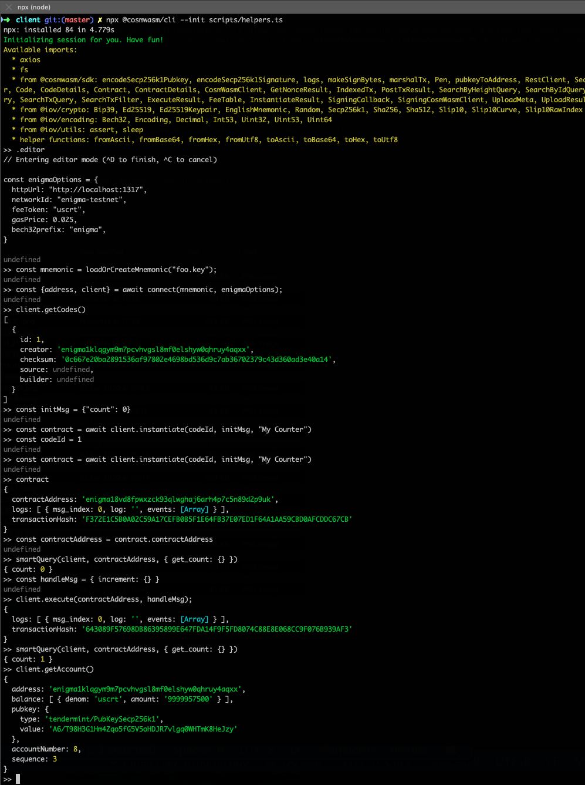

Throughout [Secret Network Contracts Introduction](README.md) we interacted with the blockchain using secretcli, we can also run a rest server and expose the api to any rest client. 

In this guide we'll use [SecretJS / CosmJS](https://github.com/cosmos/cosmjs), to power JavaScript based client solutions on Secret Network.

## Start the node

```bash
# Start secretdev from your project directory so it's mounted at /code in the container
docker run -it --rm \
 -p 26657:26657 -p 26656:26656 -p 1317:1317 \
 --name secretdev enigmampc/secret-network-sw-dev:v1.0.2
```

## Start the rest server
This allows API access to the Secret Network

**NOTE**: In a new terminal
```bash

docker exec secretdev \
  secretcli rest-server \
  --node tcp://localhost:26657 \
  --trust-node \
  --laddr tcp://0.0.0.0:1317
```

```bash
# Add SecretJS to your project
yarn add secretjs
```

## CosmWasmClient Part 1: Reading

```ts
// connect to rest server
// For reading, CosmWasmClient will suffice, we don't need to sign any transactions

const client = new CosmWasmClient("http://localhost:1317")

// Tp use holodeck testnet instead
// const client = new CosmWasmClient("https://bootstrap.secrettestnet.io")

// mainnet
// const client = new CosmWasmClient("https://api.secretapi.io/")

// query chain ID
await client.getChainId()

// query chain height
await client.getHeight()

// Get deployed code
await client.getCodes()

// Get the contracts for our simple counter
const contracts = await client.getContracts(1)

const contractAddress = contracts[0].address

// Query the current count
let count = await client.queryContractSmart(contractAddress, { "get_count": {}})
```

You can run the above by installing SecretJS locally and executing the sample script.
```bash
yarn

node scripts/secretjs-example-writing.js
```

## SigningCosmWasmClient Part 2: Writing

To increment our counter and change state, we have to connect a wallet, in this example we use a simple file-based wallet.

```ts
// Either load or create a mnemonic key from file foo.key
const mnemonic = loadOrCreateMnemonic("foo.key");

// connect the wallet, this time client is a SigningCosmWasmClient, in order to sign and broadcast transactions.
const signingPen = await Secp256k1Pen.fromMnemonic(MNEMONIC);
const address = pubkeyToAddress(
  encodeSecp256k1Pubkey(signingPen.pubkey),
  "secret"
);
const txEncryptionSeed = EnigmaUtils.GenerateNewSeed();
const client = new SigningCosmWasmClient(
  httpUrl,
  address,
  (signBytes) => signingPen.sign(signBytes),
  txEncryptionSeed, customFees
);
  

// Check account
await client.getAccount();

// If the result is `undefined` it means the account hasn't been funded.

// Upload the contract
const wasm = fs.readFileSync("contract.wasm");
const uploadReceipt = await client.upload(wasm, {});

// Get the code ID from the receipt
const codeId = uploadReceipt.codeId;

// Create an instance
const initMsg = {"count": 0}

const contract = await client.instantiate(codeId, initMsg, "My Counter")

const contractAddress = contract.contractAddress

client.queryContractSmart(contractAddress, { get_count: {} })

// The message to increment the counter requires no params
const handleMsg = { increment: {} }

// execute the message
client.execute(contractAddress, handleMsg);

// Query again to confirm it worked
client.queryContractSmart(contractAddress, { get_count: {} })

```


# What's next?

- [Frontend development](building-a-frontend.md)
